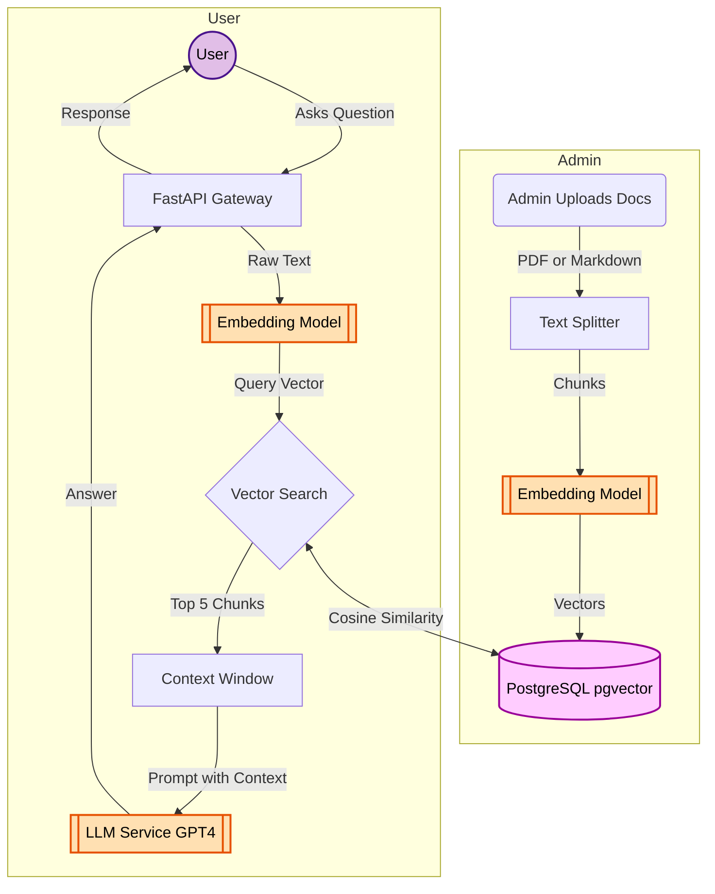

```mermaid
graph TD
    %% Define Styles
    classDef storage fill:#ffccff,stroke:#990099,stroke-width:2px,color:#000000;
    classDef processb bbdefb,stroke:#0d47a1,stroke-width:2px,color:#000000;
    classDef ai fill:#ffe0b2,stroke:#e65100,stroke-width:2px,color:#000000;
    classDef user fill:#e1bee7,stroke:#4a148c,stroke-width:2px,color:#000000;

    %% --- PHASE 1: INGESTION ---
    subgraph Ingestion [Admin]
        direction TB
        Admin(Admin Uploads Docs) -->|PDF or Markdown| Splitter[Text Splitter]
        Splitter -->|Chunks| EmbedModel1[[Embedding Model]]
        EmbedModel1 -->|Vectors| PGVector[(PostgreSQL pgvector)]
    end

    %% --- PHASE 2: INFERENCE ---
    subgraph Inference [User]
        direction TB
        Student((User)) -->|Asks Question| API[FastAPI Gateway]
        API -->|Raw Text| EmbedModel2[[Embedding Model]]
        EmbedModel2 -->|Query Vector| Search{Vector Search}
        
        %% Retrieval
        Search <-->|Cosine Similarity| PGVector
        Search -->|Top 5 Chunks| ContextBox[Context Window]
        
        %% Generation
        ContextBox -->|Prompt with Context| LLM[[LLM Service GPT4]]
        LLM -->|Answer| API
        API -->|Response| Student
    end
    
    %% Apply Styles
    class PGVector storage;
    class EmbedModel1,EmbedModel2,LLM ai;
    class Student user;
```
