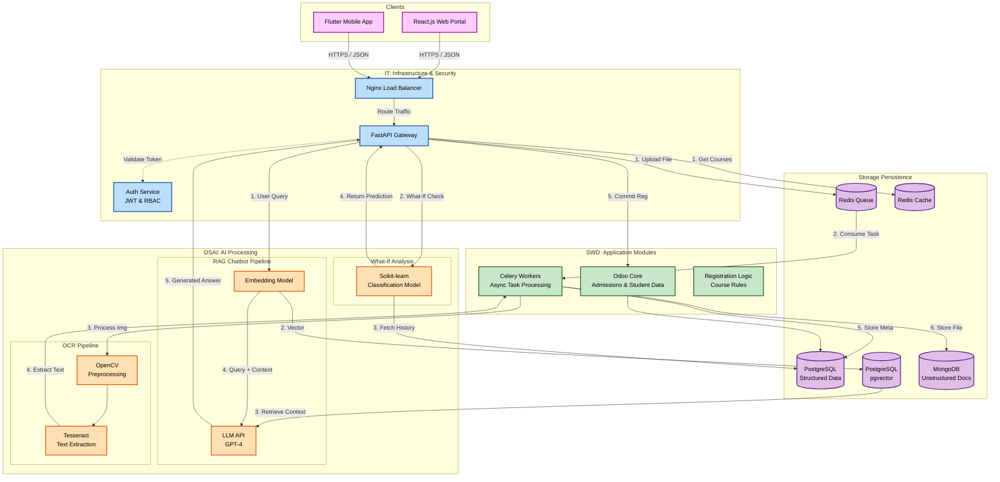

```mermaid
graph TD
    %% --- LEGEND & STYLING ---
    classDef client fill:#ffccff,stroke:#990099,stroke-width:2px,color:#000000;
    classDef it fill:#bbdefb,stroke:#0d47a1,stroke-width:2px,color:#000000;
    classDef swd fill:#c8e6c9,stroke:#1b5e20,stroke-width:2px,color:#000000;
    classDef dsai fill:#ffe0b2,stroke:#e65100,stroke-width:2px,color:#000000;
    classDef storage fill:#e1bee7,stroke:#4a148c,stroke-width:2px,color:#000000;

    %% --- CLIENT LAYER ---
    subgraph ClientLayer [Clients]
        Web[React.js Web Portal]:::client
        Mob[Flutter Mobile App]:::client
    end

    %% --- IT / INFRASTRUCTURE LAYER ---
    subgraph InfraLayer [IT: Infrastructure & Security]
        Nginx[Nginx Load Balancer]:::it
        Auth[Auth Service<br/>JWT & RBAC]:::it
        API[FastAPI Gateway]:::it
    end

    %% --- SWD LAYER (App Logic) ---
    subgraph LogicLayer [SWD: Application Modules]
        Odoo[Odoo Core<br/>Admissions & Student Data]:::swd
        Celery[Celery Workers<br/>Async Task Processing]:::swd
        RegSys[Registration Logic<br/>Course Rules]:::swd
    end

    %% --- DSAI LAYER (Intelligent Features) ---
    subgraph AILayer [DSAI: AI Processing]
        subgraph ChatPipeline [RAG Chatbot Pipeline]
            Embed[Embedding Model]:::dsai
            LLM[LLM API<br/>GPT-4]:::dsai
        end
        
        subgraph OCRPipeline [OCR Pipeline]
            CV[OpenCV<br/>Preprocessing]:::dsai
            Tess[Tesseract<br/>Text Extraction]:::dsai
        end

        subgraph RecPipeline [What-If Analysis]
            SciKit[Scikit-learn<br/>Classification Model]:::dsai
        end
    end

    %% --- DATA STORAGE LAYER ---
    subgraph DataLayer [Storage Persistence]
        RedisQ[(Redis Queue)]:::storage
        RedisC[(Redis Cache)]:::storage
        PG[(PostgreSQL<br/>Structured Data)]:::storage
        PGV[(PostgreSQL<br/>pgvector)]:::storage
        Mongo[(MongoDB<br/>Unstructured Docs)]:::storage
    end

    %% --- DATA FLOWS ---
    
    %% 1. Ingress & Security (IT)
    Web & Mob -->|HTTPS / JSON| Nginx
    Nginx -->|Route Traffic| API
    API -.->|Validate Token| Auth
    
    %% 2. RAG Chatbot Flow (DSAI + IT)
    API -- "1. User Query" --> Embed
    Embed -- "2. Vector" --> PGV
    PGV -- "3. Retrieve Context" --> LLM
    Embed -- "4. Query + Context" --> LLM
    LLM -- "5. Generated Answer" --> API

    %% 3. OCR Flow (SWD + DSAI)
    API -- "1. Upload File" --> RedisQ
    RedisQ -- "2. Consume Task" --> Celery
    Celery -- "3. Process Img" --> CV
    CV --> Tess
    Tess -- "4. Extract Text" --> Celery
    Celery -- "5. Store Meta" --> PG
    Celery -- "6. Store File" --> Mongo

    %% 4. Registration & Analytics (SWD + DSAI)
    API -- "1. Get Courses" --> RedisC
    API -- "2. What-If Check" --> SciKit
    SciKit -- "3. Fetch History" --> PG
    SciKit -- "4. Return Prediction" --> API
    API -- "5. Commit Reg" --> Odoo
    Odoo --> PG
```